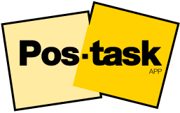

<h1 align="center">
   
  
   
  Pos-Task
   
</h1>

<h4 align="center">Una aplicacion desktop creada con <a href="https://vuejs.org/" target="_blank">Vuejs</a>.</h4>

  <a href="#about-app">About app</a> •
  <a href="#roadmap">Roadmap</a> •
  <a href="#built-with">Built With</a> •

## About app

Pos-Task es una aplicación web single page (SPA) diseñada para hacer que la gestión de tareas sea más sencilla y eficiente. Con una interfaz elegante y fácil de usar, esta app te permitirá organizar tus tareas diarias de manera rápida y eficaz.

Características destacadas:

Crear y editar tareas: Con Pos-Task, puedes agregar fácilmente nuevas tareas a tu lista. Además, si necesitas realizar cambios o agregar más detalles, la función de edición te permite modificar cualquier tarea de forma rápida y sencilla.

Marcar tareas como completadas: A medida que completas tus tareas, Pos-Task te permite marcarlas como "completadas". Esto te permite llevar un registro claro y visual de tus progresos, lo que te motiva a seguir adelante y alcanzar tus objetivos.

Eliminación sencilla de tareas: Si alguna tarea ya no es relevante o está completada, puedes eliminarla de la lista con un solo clic. Pos-Task asegura que tu espacio de trabajo se mantenga limpio y libre de distracciones innecesarias.

Interfaz intuitiva y responsive: La interfaz de Pos-Task ha sido diseñada pensando en la comodidad del usuario. Tanto si accedes desde tu computadora de escritorio como desde tu dispositivo móvil, la app se adapta perfectamente a cualquier pantalla, proporcionando una experiencia fluida y agradable.

Seguridad y privacidad: Pos-Task prioriza tu seguridad y privacidad. Todas tus tareas están protegidas y solo accesibles para ti.

Con Pos-Task, olvídate de las listas de tareas desordenadas y el caos de la organización. Simplifica tu vida y logra tus objetivos de manera más efectiva con esta poderosa y versátil app de gestión de tareas. 

## Roadmap

Week 1:
- Estudiar el boiler-plate.
- Conectar el proyecto a Supabase.
- Hacer deploy en Vercel.
- Estudiar documentacion de Supabase (CRUD)
- Crear las tablas y el storage para la base de datos de app
- Comenzar con la logica del proyecto en relacion a las operaciones CRUD

Week 2:
- Continuar con la logica del proyecto en general.

Week 3:
- Comenzar a estilar usando Bootstrap y un poco de CSS convencional (MediaQuerys).

Week 4:
- Continuar estilando la app, ultimando detalles.
- Redactar el ReadMe.
- Crear presentacion.

## Built With

- Client: [Vue.js](https://vuejs.org/) y [Vite](https://vitejs.dev/)
- Router: [Vue Router](https://router.vuejs.org/)
- Store: [Pinia](https://pinia.vuejs.org/)
- Database: [Supabase](https://supabase.com/)
- Frontend Toolkit: [Bootstrap](https://getbootstrap.com/)

